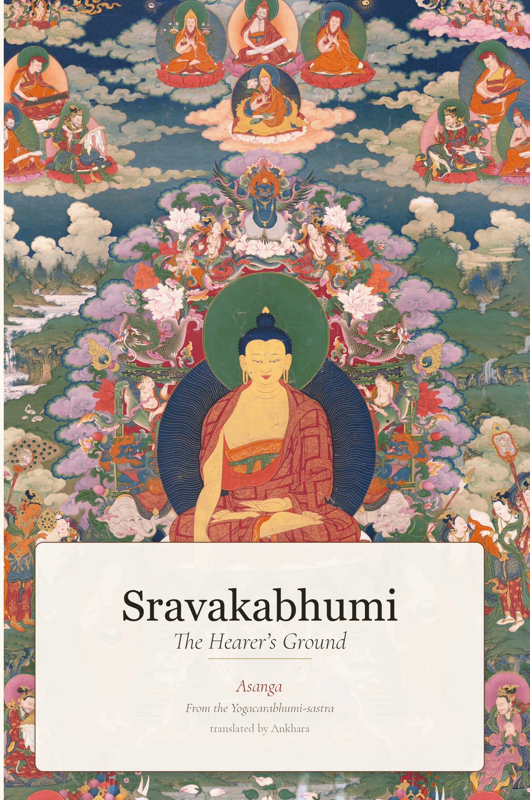

# Sravakabhumi: The Hearer's Ground

**The first complete English translation of the *Sravakabhumi* (fascicles 26–33).**

From the *Yogacarabhumi-sastra* of Asanga. Translated from the Chinese of Xuanzang (Taisho Tripitaka, Vol. 30, No. 1579).

  

---

## About This Translation

The *Sravakabhumi* (The Hearer's Ground) is a major treatise within the *Yogacarabhumi-sastra*, one of the foundational texts of the Yogacara school. It presents a comprehensive account of the Buddhist practitioner's path — from initial orientation through meditation training to the attainment of the fruits of practice. Its detailed treatment of the nine stages of mental abiding, the four types of vipashyana, and the thirty-seven factors of awakening became foundational for later contemplative traditions across Asia.

Despite its importance, no complete English translation has previously existed. This translation aims to close that gap, covering all eight fascicles of the *Sravakabhumi*: 103 sections, with 218 scholarly footnotes providing doctrinal context, cross-references, and canonical parallels.

## Read Online

**[Read the translation online](https://ankhara-namkha.github.io/sravakabhumi/)** — a clean reading experience modeled on 84000.co and Lotsawa House.

### Contents

| Fascicle | Division | Content |
|----------|----------|---------|
| 26–29 | Second Yoga Place | Person types, meditation objects, three trainings, thirty-seven awakening factors, shramana fruits |
| 30–32 | Third Yoga Place | Teacher-student protocol, nine stages of mental abiding, vipashyana framework, beginner's practical guide |
| 33 | Fourth Yoga Place | Seven attentions, dhyana commentaries, formless attainments, superknowledges |

## Download

- **[Download EPUB](https://ankhara-namkha.github.io/sravakabhumi/sravakabhumi.epub)** — free download, works in Apple Books, Kobo, and most ebook readers
- **Print edition** (Amazon KDP) — *coming soon*
- **Kindle** — *coming soon*

## Translation Approach

This translation was produced computationally using a multi-stage process designed to replicate the collaborative review workflow of established translation committees. Each section underwent a four-fold review examining terminology consistency, doctrinal accuracy, readability, and source fidelity. Nine established Buddhist translations were used to calibrate the terminological register. See the [full methodology](translation/00_methodology.md) for details.

The target register: Nanamoli's *Visuddhimagga*, Bodhi's anthologies, and the Lamrim Chenmo Translation Committee — precise, clear, and alive.

## How to Cite

> *Sravakabhumi: The Hearer's Ground.* From the *Yogacarabhumi-sastra* of Asanga. Translated from the Chinese of Xuanzang (T1579). 2026.

## License

This work is licensed under [Creative Commons Attribution-NonCommercial-ShareAlike 4.0 International](https://creativecommons.org/licenses/by-nc-sa/4.0/).

